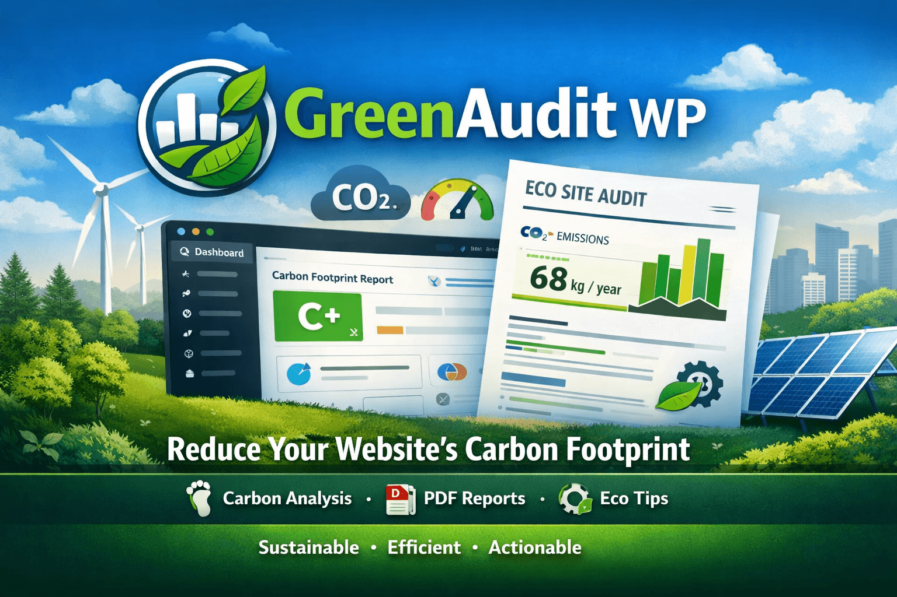
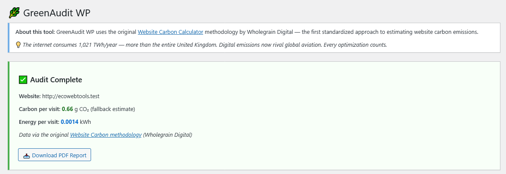
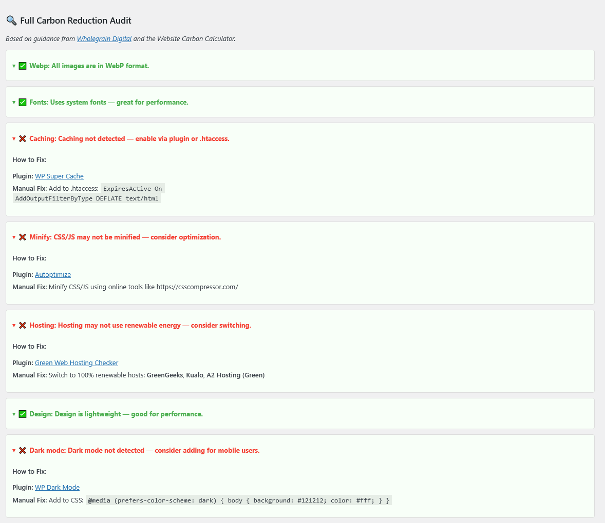

# 🌱 GreenAudit WP — Measure Your Website’s Digital Carbon Footprint

> *A WordPress plugin that calculates, visualizes, and reports your site’s energy consumption and CO₂ emissions — helping you build greener, more sustainable websites.*

---

## 📌 Why This Matters

Digital sustainability is a growing national priority. With rising energy costs and climate goals, every website owner should understand their environmental impact. GreenAudit WP empowers users to:
- 📊 Measure page load energy (kWh/pageview)
- 🌍 Estimate CO₂ emissions per visit
- 📄 Generate downloadable PDF sustainability reports
- 🎯 Identify performance bottlenecks affecting carbon output

---

## 🖼️ Screenshots

*Main dashboard showing carbon score and recommendations*

*Exportable PDF report for stakeholders*

*Customize thresholds, units, and reporting frequency*

*Detailed breakdown by page, image, script, etc.*

---

## ⚙️ Installation

1. Download the plugin from [GitHub Releases](https://github.com/tariq-tahir/greenaudit-wp/releases)
2. Upload the `greenaudit` folder to `/wp-content/plugins/`
3. Activate via WordPress Admin > Plugins
4. Go to **GreenAudit > Dashboard** to start auditing

---

## 🤝 Contributing

We welcome contributions! Please read our [Contributing Guidelines](CONTRIBUTING.md) before submitting pull requests.

---

## 📜 License

This plugin is licensed under the GNU General Public License v3.0 — see the [LICENSE.txt](LICENSE.txt) file for details.

---

## 🧭 Roadmap

- [ ] Integrate with [WebsiteCarbon.com API](https://www.websitecarbon.com/api/)
- [ ] Add automated monthly reporting emails
- [ ] Support multi-site WordPress installations
- [ ] Submit to WordPress.org Plugin Directory

---

## 📬 Contact

For questions or collaborations, reach out at [tariq@ecowebtools.org]

---

> 💡 *Built with ❤️ for a sustainable web. Aligns with U.S. Climate Goals and SDG 13.*